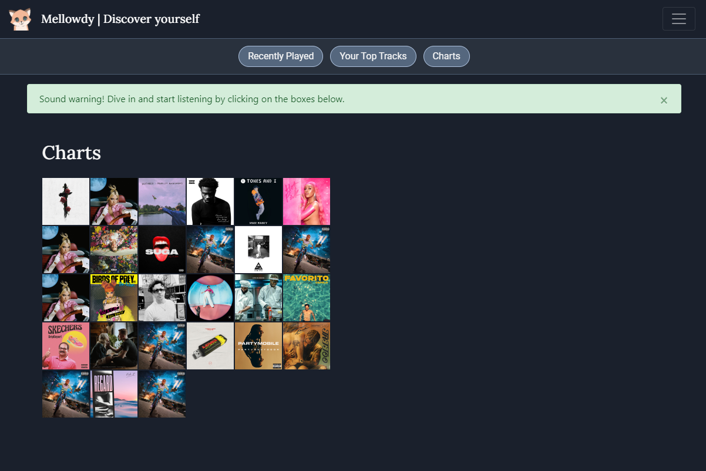

# Mellowdy for Spotify 
A front end only web application for you to discover music quickly by listening to ~30 second clips of songs powered by the Spotify API.

SOUND ON

Visit Mellowdy  
https://derrick-aung.github.io/mellowdy/

Notable Features:
- API implementation with token authentication
- Add song to playlist/library 
- Clean UI Design  

Upcoming Features:
- [ ] Search function
- [ ] Tags for genres on tagbar
- [ ] Song recommendations

To Fix:
- [X] Add alert to enhance user experience
- [X] Fix lag between user interaction and music played
- [ ] Add some prompt to user when album is empty    
